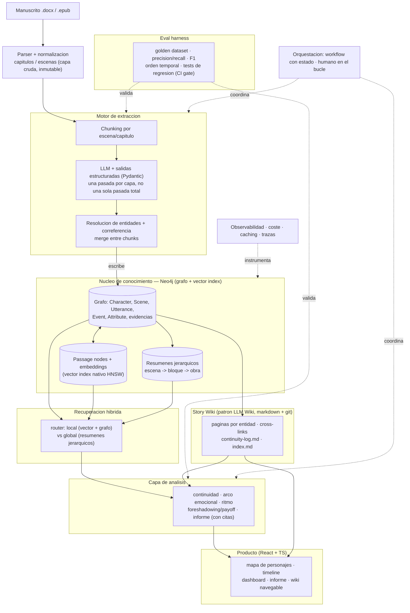

# 📖 Loom — Motor editorial de IA para ficción narrativa

> **Estado:** especificación inicial (v0.1) · **Audiencia objetivo:** autor indie / novel · **Alcance v1:** solo lo que la IA resuelve de verdad (no imprenta ni distribución física).

`Loom` (nombre provisional) toma una novela completa y construye una **representación estructurada y navegable** de ella: un grafo de conocimiento + una "Story Wiki" viva. Sobre esa base ofrece a su autor un espejo de su propio libro: mapa de personajes que evoluciona, línea temporal, arco emocional, ritmo, alertas de continuidad y un informe de lectura anclado en citas.

Este documento es a la vez el README del proyecto y el **contrato de trabajo para los agentes de código** que lo implementarán. Está escrito para que un agente pueda leerlo y saber qué construir, en qué orden, y cómo saber que lo ha hecho bien (criterios de aceptación por milestone).

---

## 1. Qué es y qué no es

**Es:** la capa de inteligencia editorial. Toma un manuscrito y produce análisis, diagnóstico y entregables que normalmente hace un editor de mesa y un lector profesional.

**No es (en v1):** una imprenta ni una distribuidora. Las etapas físicas (impresión, distribución) se *integran* más adelante con print-on-demand (KDP, IngramSpark) vía sus flujos; no se construyen.

**Principio rector — profundidad antes que amplitud.** Esto es un proyecto de portfolio de ingeniería de IA y un posible negocio. El valor está en hacer *una cosa difícil con rigor*, no nueve cosas a medias. La cosa difícil es la extracción precisa de un grafo narrativo a partir de una novela larga, y su **evaluación medible**.

---

## 2. Las tres ideas que sostienen el proyecto

1. **El grafo es la columna vertebral.** No es una feature de analítica: es el sustrato del que leen y al que escriben todas las etapas. Continuidad, arcos, informe, wiki, todo se deriva del mismo grafo. Eso convierte el producto en una plataforma coherente y no en herramientas sueltas.

2. **Compilar el conocimiento, no re-descubrirlo (patrón LLM Wiki).** El RAG clásico re-descubre el libro en cada pregunta. Aquí seguimos el patrón *LLM Wiki* (Karpathy, 2026): el LLM **compila una vez** el conocimiento en una wiki de markdown interconectada (una página por personaje, lugar, trama, tema) y la **mantiene actualizada** cuando el manuscrito cambia. La pregunta luego lee resúmenes ya elaborados, no fragmentos crudos. El grafo da la estructura consultable; la wiki da la capa legible para humanos. Se complementan.

3. **Eval-first.** Cualquiera enchufa un LLM y saca un mapa que *parece* correcto. Lo que diferencia este proyecto (y a un ingeniero senior) es **medir** si la extracción es correcta: dataset de oro, precisión/recall, tests de regresión que bloquean el merge. Ningún módulo se da por terminado sin su eval verde.

### La constitución — principios NO NEGOCIABLES

Las tres ideas de arriba, más las restricciones técnicas transversales, forman la **constitución** del proyecto: los principios que ningún milestone puede violar. Specs, planes y ADRs los citan por número; esta es su definición canónica.

- **Principio I — Eval-first (NO NEGOCIABLE).** Ningún módulo está "hecho" sin su dataset de oro y su métrica (precisión / recall / F1) corriendo como gate de CI que bloquea el merge. Lo que no se puede medir se reporta como "no medido"; nunca se rellena con un número inventado.
- **Principio II — El grafo es la única fuente de verdad.** Todo se persiste y se lee del grafo Neo4j. No se admite un segundo store (JSON/SQLite) que haya que migrar después; cada milestone solo añade nodos y relaciones, nunca altera las capas previas.
- **Principio III — Contratos tipados.** Toda salida del LLM se valida contra un esquema Pydantic antes de tocar el sistema. Prohibido el JSON en texto libre parseado a mano: el esquema *es* el contrato.
- **Principio IV — Una sola puerta por dependencia externa.** El acceso al LLM vive únicamente en `backend/llm/` (vía LiteLLM, agnóstico de proveedor por configuración); el Cypher vive únicamente en `backend/graph/`. El código de aplicación nunca sabe qué proveedor responde ni escribe Cypher suelto.
- **Principio V — Procedencia y no-alucinación.** Todo hecho del grafo rastrea a su escena y su cita literal. Nada existe sin respaldo textual; ante una ambigüedad irresoluble (p. ej. fusión de identidades dudosa), la decisión va a una cola de revisión humana en lugar de adivinarse.
- **Principio VI — Idempotencia y cache por hash.** El trabajo se recuerda: re-procesar un libro ya analizado es casi gratis y no duplica nodos ni deshace decisiones. La clave de cache incluye la versión de prompt y de esquema, de modo que un cambio de prompt invalida lo afectado.
- **Principio VII — Profundidad antes que amplitud.** Una cosa difícil con rigor antes que nueve a medias. No se avanza a la siguiente capa hasta que la actual aprueba su examen.

---

## 3. Arquitectura



La diferencia clave con la versión anterior: **Neo4j hace de grafo Y de base de datos vectorial** (tiene índice vectorial nativo HNSW). Eliminamos Qdrant/pgvector del stack. Un `Passage` es un nodo del grafo con su `embedding` como propiedad, indexado vectorialmente, y conectado por relaciones a la escena de la que procede. Así la recuperación combina similitud semántica y recorrido del grafo en una sola consulta Cypher.

---

## 4. Stack tecnológico

| Capa | Elección | Notas |
|------|----------|-------|
| Lenguaje backend | Python 3.12+ | |
| API | FastAPI + Pydantic v2 | Pydantic es **el contrato** de toda extracción LLM |
| Orquestación | Prefect (o Temporal) | Pipeline largo, reanudable, con puertas humanas. No usar una cadena de funciones suelta |
| LLM | Interfaz propia agnóstica de proveedor | Salidas estructuradas vía tool-use / JSON schema (p. ej. con `instructor`). Modelos clase Claude/GPT |
| Embeddings | Modelo de embeddings del proveedor | Guardados como propiedad de `Passage` |
| Grafo + vectores | **Neo4j 5.x** | Índice vectorial nativo + APOC. *GDS/Leiden descartado en agosto 2026 junto con los community summaries (§5, §7)* |
| Correferencia | LLM-assisted + verificación; alternativa `fastcoref`/`spaCy` | Ver §6, es el punto crítico |
| Parsing | `python-docx`, `ebooklib` (EPUB), `unstructured` | La ingesta es más sucia de lo que parece |
| Wiki | Markdown en git | Capa "compilada", versionable, renderizable en la app |
| Frontend | React + TypeScript + Vite | |
| Visualización | `react-force-graph` o Cytoscape.js (grafo), `visx`/`d3` (arcos/ritmo), `vis-timeline` (cronología) | |
| Observabilidad | OpenTelemetry + tracing LLM (p. ej. Langfuse) + conteo de tokens | |
| Tests | `pytest` (lógica) + eval harness aparte (calidad de IA) | |
| Infra dev | `docker-compose` (Neo4j + API) | |

---

## 5. Modelo de datos (esquema del grafo)

Pensado para **ficción narrativa**. Toda propiedad relevante guarda `asserted_in_scene` para poder rastrear el origen (citas) y detectar contradicciones.

### Nodos

**Regla de admisión al grafo** (decidida en agosto 2026, ver §12 y `docs/graph-north.md` §3):
va al grafo lo que **se puede recalcular de forma determinista desde evidencia ya
persistida, sin volver a llamar al LLM**, y está anclado a escena + cita. **No va el
veredicto** — "esto es un error de continuidad", "aquí decae el ritmo", "el tema es X".
Eso es una consulta sobre el grafo, no un nodo dentro de él.

### Nodos

**En el grafo hoy (M0–M3):**

- **`Manuscript` / `Chapter` / `Scene`** — estructura y orden de lectura (`NEXT_*`). `Scene` lleva `order_narrative_global`.
- **`NonNarrativeBlock`** — bloques que no son escena (dedicatorias, epígrafes) apartados en la ingesta.
- **`Character`** — `canonical_name`, `aliases[]`, `mention_count`, `appearance_count`, `merged_from[]`.
- **`Mention`** — cada aparición nombrada, con su escena. Evidencia cruda del reparto.
- **`MergeCandidate`** — dos personajes que podrían ser el mismo, a revisión humana.
- **`RelationEvidence`** — evidencia por escena de un vínculo, con tipo, descriptor, roles y cita. Agrega a la arista `RELATES_TO`.
- **`Attribute`** / **`AttributeEvidence`** — rasgos por personaje (`key` de catálogo cerrado, `value_norm`, cita). **Los valores contradictorios NO se colapsan**: cada valor distinto es un nodo, para preservar la señal que consumirá el detector de continuidad.

**Planificados, con milestone:**

- **`Passage`** (M4) — `text`, `embedding`, enlazado a su `Scene`. Unidad de recuperación y **fuente de toda cita**.
- **`Utterance`** (M5) — intervención de diálogo con `speaker`, `addressee`, `quote_type`. Permite separar lo narrado de lo dicho por un personaje.
- **`Scene.summary` / `Scene.place` / `Scene.time_marker` / `Scene.narrative_plane`** (M6) — propiedades, no nodos. El resumen es jerárquico (escena→bloque→obra); el plano distingue marco de relato enmarcado (ver §12).
- **`Manuscript.tech_sheet`** (M4) — la ficha técnica: convenciones tipográficas de la obra, versionada y firmada por un humano. No es un hecho extraído: es un **parámetro de la corrida**, como el modelo o la versión del prompt. Ver §6.3.
- **`Event`** (M7) — `description`, a granularidad de escena, con `order_chronological` **relativo, nullable y marcado `inferred`**.

**Descartados del modelo, con motivo:**

| Pieza | Por qué no |
|---|---|
| `Scene.sentiment` | Ni las personas se ponen de acuerdo anotándolo; la señal solo emerge agregando cientos de fragmentos, muy por encima del tamaño de una escena |
| `Scene.tension_score` (0–1) | El valor absoluto es irreproducible. Si se recupera, será un **delta ordinal** entre escenas contiguas, marcado `inferred` y con gate no bloqueante — y como análisis (M9), no como propiedad del grafo |
| `Theme` | Con solo 10 categorías cerradas se acierta ~la mitad de las veces, y los LLM rinden por debajo de un clasificador estadístico simple |
| `PlotThread` + `PART_OF` | Nadie lo ha evaluado contra un gold. La pertenencia a trama no es decidible escena a escena; la jerarquía de resúmenes (M6) cubre la función |
| `Motif` + `PLANTED_IN`/`PAID_OFF_IN` | En descubrimiento abierto se acierta ~un tercio. Pasa a M9 como análisis, y solo tras un gate sobre obra crafted con la "pistola" plantada a propósito |
| `Location` como nodo | "Mismo lugar" ya forma parte de la definición de escena. Degradado a `Scene.place` con cita (M6) |
| `CommunitySummary` | Indexar comunidades cuesta aproximadamente lo mismo que construir el grafo entero; con capítulos y escenas la jerarquía sale gratis (M6) |
| `RelationshipState` versionado | Solo una minoría de vínculos cambia a lo largo de la obra, y la red estática iguala o supera a la dinámica en las mediciones publicadas |
| `Character.voice_profile` | Estilometría de diálogos: es análisis derivado, y además depende de M5. Va a M9 si se justifica |

### Relaciones

```
(Character)-[:HAS_MENTION]->(Mention)
(Character)-[:APPEARS_IN {kind, mention_count}]->(Scene)
(Character)-[:RELATES_TO {rel_type, descriptor, confidence}]->(Character)
(RelationEvidence)-[:ABOUT]->(Character)      // ×2, el par
(RelationEvidence)-[:IN_SCENE]->(Scene)
(Character)-[:HAS_ATTRIBUTE]->(Attribute)
(AttributeEvidence)-[:ABOUT]->(Character)
(AttributeEvidence)-[:IN_SCENE]->(Scene)
(Chapter)-[:HAS_SCENE]->(Scene)
(Scene)-[:NEXT_SCENE]->(Scene)                // orden de lectura
--- planificadas ---
(Passage)-[:FROM]->(Scene)                    // M4
(Utterance)-[:IN_SCENE]->(Scene)              // M5
(Utterance)-[:SPOKEN_BY]->(Character)         // M5
(Event)-[:INVOLVES]->(Character)              // M7
(Event)-[:IN_SCENE]->(Scene)                  // M7
```

`BEFORE` entre hechos **no se extrae**: se deriva de `order_chronological`. Pedirle al
modelo que decida el orden de cada par obliga a pronunciarse también donde el texto es
vago, y genera contradicciones circulares que después hay que limpiar.

---

## 6. Pipeline de extracción (el módulo más difícil)

Orden de procesamiento por escena/capítulo, con **map-reduce** para no reventar el contexto ni el coste:

1. **Chunking** por escena (preferible) o capítulo. Mantener metadatos de posición.
2. **Extracción estructurada**: el LLM devuelve objetos Pydantic (nunca texto libre que luego parseamos). **Una pasada por capa, no una sola pasada que lo extraiga todo** — el diseño original planteaba una única llamada por chunk para personajes, relaciones, eventos, atributos y motivos; la implementación real las separó (M1 personajes, M2 relaciones, M3 atributos) y esa separación se mantiene deliberadamente: pedirle N cosas distintas a la vez degrada cada una, y cada capa necesita su propio gate, su propia caché y su propia versión de prompt.
3. **Resolución de entidades + correferencia** — *el problema central*. "Elena", "ella", "la doctora", "Eli" deben colapsar en una entidad a lo largo de 100k palabras. Estrategia recomendada:
   - Mantener un **registro de entidades** acumulado que se pasa como contexto a cada chunk ("estos personajes ya existen: …") para que el LLM enlace en vez de duplicar.
   - Fusión por similitud (embedding del nombre + heurísticas) con **umbral de confianza**; por debajo del umbral, marcar para **revisión humana** (no fusionar a ciegas).
   - La calidad de esta fusión se mide explícitamente en la eval (ver §9).
4. **Escritura idempotente al grafo**: cada chunk se cachea por *hash de contenido*, de modo que re-ejecutar el pipeline tras un cambio menor sea barato. **Todo lo que el prompt recibe entra en la clave de caché** — si el contexto cambia, el resultado cacheado es inválido. (Deuda abierta: la caché de M1 no incluye el registro de entidades aunque el prompt sí lo recibe. Ver `docs/known-issues.md` §9.)

> ⚠️ **Si esto falla, todo lo demás es ruido.** Aquí va el grueso del esfuerzo de I+D y aquí empieza la eval (M1).

### 6.1 Qué se agrupa en una misma pasada (decidido 2026-08-03)

**Agrupar ayuda cuando lo que pides son respuestas distintas a la misma lectura**; perjudica
cuando las tareas compiten. Compiten en tres casos: una necesita el resultado ya resuelto de
la otra; cada una arrastra su catálogo cerrado y al juntarlas el catálogo total crece
(ampliar el catálogo de tipos degrada la extracción de forma medida); o las salidas tienen
formas muy distintas y una desplaza a la otra.

| Capa | Pasada | Motivo |
|---|---|---|
| M4 pasajes | **Sin LLM** | Trocear, embeddings e índice. No hay nada que preguntar |
| M5 quién habla | **Propia** | Salida larga y de tamaño variable (una escena de diálogo puro puede tener 80 intervenciones); mezclarla con salidas cortas provoca truncamientos |
| M6 resumen + lugar + marca temporal + plano narrativo | **Una sola** | Cuatro respuestas a "lee esta escena y descríbela". Sin catálogo grande, sin dependencia mutua |
| M7 hecho central de la escena | **Medir si va con M6** | "Qué ocurre aquí" y "resume esto" son casi la misma pregunta. Se decide con las dos variantes sobre obra crafted, no por opinión |
| M7 posición cronológica | **Propia, y después** | No es "leer una escena": es comparar escenas. Corre sobre resúmenes y marcas temporales ya extraídos, nunca sobre el texto crudo |
| M1 / M2 / M3 | **Separadas, como están** | El único argumento para juntar relaciones y atributos era el coste, descartado como criterio |

**Precio de agrupar, aceptado a conciencia**: la caché se vuelve más gruesa (tocar una
instrucción invalida las cuatro salidas), el gate deja de ser independiente por campo, y el
diagnóstico exige desglosar cuando la calidad baja.

### 6.2 Qué contexto recibe cada capa (decidido 2026-08-03)

Una escena aislada no siempre basta. Pero el contexto se da **donde hay dependencia real**,
no por defecto:

| Capa | Contexto de fuera de la escena |
|---|---|
| M1 personajes | Registro de nombres acumulado (ya implementado, `backend/extraction/registry.py`) |
| M2 relaciones · M3 atributos | Ninguno más allá del cast. El vínculo y el rasgo se afirman dentro de la escena |
| M5 quién habla | **La escena anterior**: si el diálogo viene arrancado de antes, el turno alternado empieza fuera |
| M6 escena | **La escena anterior**: el lugar a menudo no se re-declara, y *"tres días después"* necesita saber después de qué |
| M7 cronología | **Varias escenas**. No existe la versión aislada |

Tres reglas que gobiernan esto:

1. **El contexto vecino es texto literal del libro, nunca la interpretación que otra capa
   hizo de él.** Así la huella de caché sigue siendo determinista, el orden de procesamiento
   deja de importar (se pueden paralelizar escenas), y no se arrastran interpretaciones del
   modelo de una escena a otra. El texto crudo no cambia; solo cambiaría si el autor edita.
2. **Los hechos del grafo van con su coordenada, no con su cita literal.** Al prompt le
   basta `Elena Ruiz (chr_a4f1) — ojos verdes [c2/e3] · médica [c1/e1]`. La cita se queda en
   el grafo, donde ya está, para auditar. Treinta hechos anclados ocupan menos que un párrafo
   de resumen y encima son trazables.
3. **Selección por anclaje a la escena con presupuesto declarado**, nunca "todo lo conocido
   hasta ahora" (salvo M1, cuyo registro son solo nombres). Si no cabe, se corta **y se
   registra que se cortó**: un contexto truncado en silencio es indistinguible de un contexto
   vacío cuando diagnosticas.

**Aplazado**: traer escenas similares por embeddings. No por complejidad técnica —el índice
vectorial de M4 lo da casi gratis— sino porque *"escena parecida"* no es *"escena útil"*: la
más similar a una discusión es otra discusión, que probablemente no aporta nada. Sin medición
de si mejora, es una palanca que no sabes en qué dirección mueve.

**Aplazado**: un agente que navegue el grafo pidiendo lo que necesita (recuperación
iterativa). Es la respuesta correcta a "a veces le damos contexto que no necesitaba", y el
patrón es viable —las funciones de lectura de `backend/graph/` ya sirven como herramientas—
pero **un agente que decide qué mirar convierte cada extracción en no reproducible**: dos
corridas pueden consultar cosas distintas. Requisito para admitirlo cuando llegue: que
devuelva la traza de lo que consultó, de modo que la corrida sea re-ejecutable con esa traza
como entrada fija.

### 6.3 La ficha técnica de la obra (decidido 2026-08-03)

Lo único que el pipeline inyecta **en prosa**, porque no es un hecho sobre el contenido sino
sobre el **dispositivo narrativo**: cómo está contada la obra. Un modelo que mira una escena
a ciegas no puede deducirlo, y un lector humano lo sabe desde la página tres.

**Qué lleva hoy** — solo lo tipográfico, que es verificable sin LLM:

```
Diálogo: raya (—)
Pensamiento: cursiva, sin verbo introductorio
```

Es lo que resuelve el caso que motivó la decisión: un personaje que **piensa** "te amo" no
afirma el mismo vínculo que uno que lo **dice**. Sin saber la convención de la obra, M2
extrae una reciprocidad que el texto no sostiene.

**Cómo se obtiene y se gobierna:**

- **De una muestra fija y declarada** de escenas (p. ej. tres del inicio, tres del medio, tres
  del final): reproducible, y cuando la ficha esté mal sabes exactamente qué leyó el modelo.
  Sale del **texto crudo**, no del grafo poblado — tiene que existir antes que M2/M3.
- **Cada campo con su confianza. Los que bajan del umbral los firma un humano** — en la
  práctica, el propio autor. Mismo patrón que `MergeCandidate`: el sistema propone, la
  persona confirma solo lo dudoso. Es el único artefacto con revisión humana obligatoria,
  y se justifica solo: son cuatro líneas, y es el único punto del diseño donde un error del
  modelo contamina **todas** las escenas a la vez.
- **Versionada y congelada dentro de la corrida.** Puede mejorar entre corridas; cambiarla es
  una decisión explícita que invalida caché, igual que subir un `PROMPT_VERSION`. Si cambiara
  a media corrida, el grafo quedaría con dos criterios mezclados sin marca de cuál es cuál.
- **Prosa anclada a tramos, no formulario.** Un enum no representa un relato enmarcado: en
  *El nombre del viento* narra una voz externa al principio y Kvothe en primera persona
  después. Elegir un valor único le miente al modelo durante media novela. Por eso las
  afirmaciones llevan el tramo al que aplican — y **cada escena recibe solo el trozo que le
  aplica**, con lo que se deja de inyectar contexto que no se necesita.
- **Las capas siguientes la verifican contra el texto.** Si dice "diálogo con raya" y al
  detectar intervenciones no aparece ni una raya, salta el aviso. Convierte la ficha de
  premisa en la que confías a hipótesis que el pipeline falsa — sin depender de que el
  modelo acertara.

**Riesgo conocido y cómo se ataja.** Decirle a una escena *"aquí Kvothe narra su historia a
Cronista"* puede hacer que el modelo **meta a Cronista en el reparto**, y el reparto es el
universo cerrado del que beben M2 y M3: un personaje colado ahí se propaga a dos capas con
cita y con apariencia de dato. Dos defensas:

1. **La ficha instruye, no describe.** El modelo falla por incluir de más, así que el texto
   lleva las negaciones explícitas: *"narrar no es estar presente; no lo incluyas salvo que
   actúe o hable en la escena; el oyente del relato no está presente"*.
2. **Mejor aún: lo determinista sale del prompt.** Si la ficha declara que en un tramo el
   "yo" es Kvothe, las menciones en primera persona se enlazan **en código**, no por criterio
   del modelo. Y si declara que un personaje pertenece al plano del marco, se **rechaza
   automáticamente** su aparición en escenas del plano narrado. No dependes de que el modelo
   obedezca: lo aplicas después.

El fallo que esto previene —"aparece alguien que no está en la escena"— es exactamente lo que
mide la precisión de reparto del gate de M1. No hace falta métrica nueva.

---

## 7. Recuperación híbrida + GraphRAG

Dos tipos de pregunta necesitan dos caminos:

- **Local** ("¿cuándo se conocieron Elena y Marco?"): búsqueda vectorial sobre `Passage` (índice nativo de Neo4j) + expansión por el grafo (1–2 saltos) → respuesta anclada en citas de pasajes.
- **Global** ("¿cuál es el arco general?", "¿qué temas dominan?"): el RAG normal falla porque la respuesta no está en ningún chunk concreto. Se responde agregando **resúmenes jerárquicos** precompilados sobre la estructura que la obra ya tiene: escena → bloque → obra (M6). *Decidido en agosto de 2026*: **no** se usa detección de comunidades (Leiden/GDS) ni nodos `CommunitySummary`. Indexar comunidades cuesta aproximadamente lo mismo que construir el grafo entero, y una novela ya viene con su jerarquía puesta — capítulos y escenas — así que agrupar por comunidades compra poco que la estructura no dé gratis. Ver README §5, tabla de descartes.

Un **router** clasifica la consulta (local vs global) y elige el camino. Toda respuesta analítica **debe** enlazar al menos a un `Passage` (id) — sin cita, no se muestra. Esto es lo que mata la alucinación.

---

## 8. Story Wiki (patrón LLM Wiki aplicado a la novela)

Tres capas, al estilo Karpathy:

1. **Fuentes (inmutable):** el manuscrito normalizado.
2. **Wiki (generada por el LLM):** directorio de markdown interconectado — `characters/elena.md`, `locations/la-casa.md`, `threads/la-herencia.md`, `themes/perdon.md`, más `index.md` y `continuity-log.md`. Cada página: resumen, hechos, wikilinks a entidades relacionadas, y **enlaces a las escenas/pasajes que la sustentan**.
3. **Esquema (reglas):** qué tipos de página existen, qué frontmatter llevan, cómo se enlazan.

La wiki se **deriva del grafo** y se **mantiene con awareness del diff**: cuando el autor edita capítulos, solo se regeneran las páginas afectadas. Es la "biblia de la historia" que un autor de serie pagaría por sí sola, y como es git, el autor obtiene historial y diffs gratis. (Bonus meta: el propio repositorio del proyecto puede mantener su documentación con este mismo patrón.)

---

## 9. Eval harness (la pieza que te hace senior)

**Golden dataset:** anotación humana del libro de tu amigo (y, después, 1–2 novelas de dominio público de Project Gutenberg para robustez): lista real de personajes, alias, relaciones, cronología de eventos, atributos clave.

**Métricas:**

- Extracción de entidades: **precision / recall / F1**.
- Resolución de entidades (clustering): **B-cubed** o F1 por pares.
- Extracción de relaciones: **F1**.
- Orden cronológico de eventos: **tau de Kendall** vs el orden anotado.
- Detección de continuidad: **precisión de las alertas** (¿lo marcado es un error real?) — métrica crítica, los falsos positivos destruyen la confianza.
- Calidad del informe de lectura: **LLM-as-judge** con rúbrica fija (usar con cautela, complementar con revisión humana puntual).

**Regresión:** se ejecuta en cada cambio de prompt o modelo; los resultados se versionan en una tabla y actúan de **gate en CI**: si una métrica clave baja, no se mergea. Un pequeño `eval/` con runner, datasets y reporte comparativo.

---

## 10. Orquestación, operación y coste

- **Workflow con estado** (Prefect/Temporal): cada manuscrito es un proceso largo, reanudable, con pasos idempotentes y **puertas de aprobación humana** (p. ej. confirmar fusiones de entidades dudosas).
- **Caching agresivo**: extracción cacheada por hash de contenido + prompt caching del proveedor. Re-procesar un libro tras editar un capítulo solo recomputa lo cambiado.
- **Observabilidad**: trazas de cada llamada LLM, conteo de tokens y coste por etapa, para poder optimizar y para demostrar madurez de ingeniería.

---

## 11. Estructura del repositorio

```
loom/
├── README.md                 # este documento
├── docker-compose.yml        # Neo4j + API
├── docker-compose.langfuse.yml # stack Langfuse self-hosted (opt-in, ADR-0003)
├── backend/
│   ├── ingest/               # parsers docx/epub → capa cruda
│   ├── extraction/           # LLM + Pydantic schemas + entity resolution
│   ├── graph/                # cliente Neo4j, Cypher, esquema, migraciones
│   ├── retrieval/            # router local/global, vector + GraphRAG
│   ├── wiki/                 # generador/mantenedor de la Story Wiki
│   ├── analysis/             # continuidad, arcos, ritmo, foreshadowing, informe
│   ├── llm/                  # interfaz agnóstica de proveedor
│   ├── observability/        # puerta única a Langfuse (opt-in, ADR-0003)
│   ├── orchestration/        # flujos Prefect/Temporal
│   └── api/                  # FastAPI
├── eval/                     # golden datasets, runner, métricas, reportes
├── frontend/                 # React + TS (mapa, timeline, dashboard, wiki)
├── wiki/                     # Story Wiki generada (markdown, versionada)
└── docs/                     # ADRs, decisiones de diseño
```

---

## 12. Roadmap por milestones (depth-first, eval-gated)

Cada milestone tiene un **criterio de aceptación**. No se avanza al siguiente sin cumplirlo.

- **M0 · Scaffolding.** Repo, docker-compose con Neo4j, FastAPI skeleton, ingesta `.docx`→capítulos/escenas normalizados (capa cruda). *DoD: subir el libro de tu amigo y verlo segmentado correctamente en escenas.*
- **M1 · Personajes + eval (núcleo del portfolio).** Extracción y resolución de **solo personajes** → grafo. Eval harness con golden dataset. *DoD: F1 de detección ≥ umbral objetivo y precisión de resolución medida sobre el libro real.*
- **M2 · Relaciones entre personajes + eval.** Extracción de relaciones por par (tipo, descriptor, procedencia) → grafo. *DoD: F1 de detección de pares y accuracy de tipo ≥ umbral sobre obras crafted.* (El bloque "M2 = relaciones + atributos + continuidad" del plan original se descompuso: relaciones aquí, atributos en M3, detección de continuidad como consumidor posterior del grafo.)
- **M3 · Atributos de personaje + eval.** Extracción de atributos invariantes físicos/identidad + estado vital (`Attribute`/`AttributeEvidence`), con procedencia escena+cita y **sin colapsar valores contradictorios** (la señal que habilita la continuidad). *DoD: F1 de extracción de tripletas `(personaje, key, valor)` ≥ umbral; la contradicción "ojos azules cap.2 / verdes cap.18" queda representada como dos valores del mismo atributo.* La **detección de continuidad** (alertas, precisión de alertas) es una spec de análisis posterior que consume esta capa.
- **M4 · Pasajes y respuesta con cita.** `Passage` enlazado a su escena, índice léxico + vectorial, y el eval de preguntas verdadero/falso que hoy no existe. Es la unidad de recuperación y la fuente de toda cita. También entra aquí la **ficha técnica** (`Manuscript.tech_sheet`, §6.3): es barata, la consumen las capas siguientes, y su experimento de validación está en las precondiciones de más abajo. *DoD: responder preguntas de detalle sobre la novela real citando el pasaje, y **batir a un baseline sin grafo** en esas mismas preguntas.*
- **M5 · Voz: quién dice qué.** `Utterance` por intervención de diálogo, con hablante, destinatario y tipo de cita, colgado de la escena. Habilita distinguir lo que el narrador afirma de lo que un personaje dice (y puede estar mintiendo). *DoD: accuracy de atribución de hablante ≥ umbral sobre obra crafted; diagnóstico sobre novela real.*
- **M6 · Escena: resumen, lugar, marca temporal y plano narrativo.** `Scene.summary` con jerarquía escena→bloque→obra (sustituye a los community summaries), `Scene.place` con cita, `Scene.time_marker` literal, y `Scene.narrative_plane` (marco vs relato enmarcado). Las cuatro salen de **una sola pasada**: son respuestas distintas a la misma lectura (§6.1). **Sin `sentiment`.** *DoD: los resúmenes mejoran las respuestas globales frente a solo pasajes, medido; y los puntos de cambio de plano confirmados por el autor.*
  - **El plano no se pregunta escena a escena: se detecta y se propaga.** Es pegajoso — una vez dentro del relato, se sigue dentro hasta que hay señal de vuelta (cambia la persona gramatical o el tiempo verbal, aparecen personajes del marco, hay fórmula de apertura/cierre de relato oral). Los cambios de plano **coinciden con límites de escena**, porque el autor los marca tipográficamente para no perder al lector (Rothfuss llega a titular capítulos "Interludio"), y esos cortes son los que el segmentador de M0 ya localiza.
  - **La confirmación humana es de las transiciones, no de las escenas.** Al autor no se le pregunta dónde cambia el narrador —no lo recordará— sino que se le muestran los ~6 puntos detectados con sus primeras líneas para que confirme. De 300 decisiones a 6. Mismo patrón que `MergeCandidate`.
  - **El número de transiciones es control de calidad gratis**: si el sistema dice que el plano cambia 80 veces, está roto y se sabe sin abrir el libro.
  - **Por qué merece la pena**: convierte el caso más difícil de ordenar (novela con estructura de marco) en el más fácil para M7 — el plano del relato es anterior al del marco, y dentro de cada plano el orden narrativo casi coincide con el cronológico. Sin planos, un relato enmarcado es un flashback de 800 páginas que el modelo debe descubrir escena a escena.
  - **Para la demo: detectar si el libro tiene el problema, no resolverlo.** La mayoría de las novelas tienen narrador único. Si al leer la muestra de la ficha aparecen dos personas gramaticales en tramos distintos, se marca el manuscrito como "estructura narrativa compleja" y se avisa. Si no, no se toca el asunto.
- **M7 · Hechos y cronología.** `Event` a granularidad de escena + `INVOLVES`. Posición cronológica **relativa, con empates y con "no sé" admitido**, marcada `inferred`; `BEFORE` se **deriva** de la posición, no se le pide al modelo. *DoD: contra obras crafted con cronología conocida por construcción — exact-match y accuracy por pares, separando pares cercanos de lejanos, y **batiendo al baseline trivial** "la novela va en orden".*
- **M8 · Story Wiki.** Generación y mantenimiento diff-aware de la wiki markdown (híbrida grafo + prosa — ver `docs/graph-north.md`). *DoD: editar un capítulo regenera solo las páginas afectadas.*
- **M9 · Análisis (consumidores, fuera del grafo).** Detector de continuidad, ritmo, arco emocional, foreshadowing/payoff, informe de lectura. Se **calculan sobre el grafo**; sus veredictos no se persisten en él. *DoD: informe generado, sin afirmaciones sin cita, y con la tasa de falsos positivos medida.*
- **M10 · Frontend.** Mapa de personajes, timeline, dashboard, informe, wiki navegable. *DoD: recorrido completo desde subir libro hasta explorar resultados.*
- **M11 · Endurecimiento.** Orquestación, observabilidad, coste, caching. *DoD: re-proceso incremental barato + trazas y coste por etapa visibles.*

### Precondición antes de M4: medir de verdad lo ya construido

M1–M3 están implementados y con gate en verde, pero **el gate corre sobre obras
sintéticas pequeñas y un gold incompleto**. Antes de apilar una capa más:

1. **Correr M3 sobre novela real** (P&P / HP1). Hoy solo existen corridas sobre
   `crafted-attributes.txt` (12 tripletas). M2 sí tuvo su diagnóstico real; M3 no.
2. **Arreglar el catálogo de `key`**: `gender` tiene recall 0 medido — sacarlo o
   derivarlo de los pronombres de M1 en vez de pedírselo al LLM. El gate pasó de
   fallar con 7 keys a aprobar con 5 sin que cambiara ningún número (F1 = 0,727
   en ambos casos): eso hay que dejar de presentarlo como frontera empírica.
3. **Publicar el techo de M2/M3**: correrlos una vez con un cast anotado a mano
   (oracle) y medir el delta contra el cast real. Ese número es el techo de ambas
   capas y hoy no se conoce.
4. **Dejar de reportar precision cruda contra gold parcial.** Puntuar en mundo
   cerrado local (solo las claves anotadas) o auditar arista por arista exigiendo
   cita. El perfil actual (recall 0,94–1,0 / precision 0,07–0,29) es el inverso del
   fallo típico de un extractor LLM: apunta a gold incompleto, no a calidad alta.
5. **Medir el efecto de la ficha técnica antes de cablearla en cinco capas**
   (decidido 2026-08-03). Correr M2 y M3 con ficha y sin ficha sobre las obras
   crafted y comparar: el gold ya existe y la caché hace la segunda corrida barata.
   Sale una tarde y responde tres cosas: si la ficha mejora, cuánto, y **si merece
   reprocesar M2/M3**, que corrieron sin ella y por tanto pueden estar peor de lo que
   podrían. Razón para no darlo por supuesto: más contexto es también más sitio donde
   despistarse — un marco que ayuda es un marco que sesga.
   - **Obra crafted nueva para esto**: una escena donde alguien *piense* "te amo" y
     otra donde lo *diga*, con el vínculo correcto anotado en cada caso. Es el caso
     que motivó la ficha, convertido en examen.

### Por qué este orden y no el anterior

El roadmap anterior ponía eventos y timeline en M4 y los pasajes en M5. Se
invirtió tras el contraste con la literatura (agosto 2026):

- **La única ganancia medida sobre novelas viene del enlace pasaje→entidad.** Sin
  `Passage` no hay respuesta con cita, que es el producto declarado (§7, §8).
- **Sin `Passage` no se puede medir si M2 y M3 aportan.** Todo lo que se sabe hoy
  de ellos es F1 contra gold parcial, que no dice nada sobre utilidad. Cada capa
  nueva debe batir a un baseline de recuperación por pasajes o no entra.
- **En pruebas publicadas sobre novelas, un grafo de entidades y relaciones rinde
  por debajo de la búsqueda vectorial plana** en preguntas de detalle — justo las
  que este grafo pretende servir. El grafo suma cuando ancla a pasajes, no solo.
- **Ordenar hechos automáticamente no es una tarea resuelta**: los modelos
  zero-shot quedan muy por debajo de sistemas supervisados, y empeoran cuanto más
  separados están los dos hechos — exactamente el caso del flashback. Por eso M7
  va después y con un DoD que puede fallar de verdad.

---

## 13. Convenciones para los agentes de código

- **Pydantic es el contrato.** Ninguna salida de LLM se parsea como texto libre; siempre esquema tipado validado.
- **Una sola puerta al LLM.** Todas las llamadas pasan por `backend/llm/`; nada de SDKs dispersos por el código.
- **Citas obligatorias.** Toda afirmación analítica referencia un `Passage` por id. Sin cita, no se emite.
- **Idempotencia y cache.** La extracción se cachea por hash de contenido; re-ejecutar debe ser barato y determinista en lo posible.
- **Eval antes de merge.** Un milestone no está "hecho" sin su eval verde. Los tres gates (M1 personajes, M2 relaciones, M3 atributos) corren en CI sobre las obras crafted, con las respuestas del LLM congeladas en `eval/fixtures/llm-cache/` — así el gate mide el código, es determinista y no gasta cuota. `LOOM_EVAL_STRICT=1` impide que un gate se omita en silencio. En local: `make verify`. Las novelas completas siguen siendo diagnóstico manual, no gate.
- **Cypher revisable.** Las consultas al grafo viven en `backend/graph/` con nombre, no incrustadas ad hoc.
- **Docs vivas.** La carpeta `docs/` y la Story Wiki se mantienen con el patrón LLM Wiki: cada cambio relevante actualiza la página correspondiente.
- **Observabilidad opt-in, nunca gate.** Langfuse (ADR-0003) instrumenta corridas reales de extracción; el eval harness lo deshabilita explícitamente y CI nunca depende de que esté arriba.

---

## 14. Riesgos y mitigaciones

| Riesgo | Mitigación |
|--------|-----------|
| Extracción imprecisa (riesgo nº1) | Eval-first desde M1; nada se construye encima de métricas rojas |
| Alucinación en análisis/informe | Anclaje obligatorio a `Passage` + citas |
| Coreference/resolución difícil | LLM-assisted + umbral de confianza + revisión humana de fusiones dudosas |
| Coste en tokens (libros largos) | Map-reduce + cache por hash + prompt caching |
| Eval con un solo libro | Añadir novelas de dominio público (Gutenberg) |
| Confianza/privacidad del autor | "No entrenamos con tu obra"; manejo de datos explícito; opción de borrado |
| Feature creep | Roadmap depth-first; resistir portada/traducción/imprenta hasta tener el núcleo sólido |

---

## 15. Glosario

- **Grafo de conocimiento narrativo:** representación en Neo4j de personajes, relaciones, atributos, diálogo y eventos de la novela, cada hecho con su escena y su cita.
- **Patrón LLM Wiki:** compilar y mantener una wiki markdown interconectada en vez de re-recuperar fragmentos en cada consulta.
- **GraphRAG:** RAG que combina búsqueda sobre pasajes con navegación del grafo, y resúmenes jerárquicos para las preguntas globales. En este proyecto la jerarquía es la de la propia obra (escena→bloque→obra), no comunidades detectadas.
- **Resolución de entidades:** colapsar todas las menciones (nombres, alias, pronombres) de una misma entidad en un nodo único.
- **Eval harness:** conjunto de datasets de oro + métricas + tests que miden la calidad del sistema de IA, no solo del modelo.
- **DoD (Definition of Done):** criterio objetivo que cierra un milestone.
