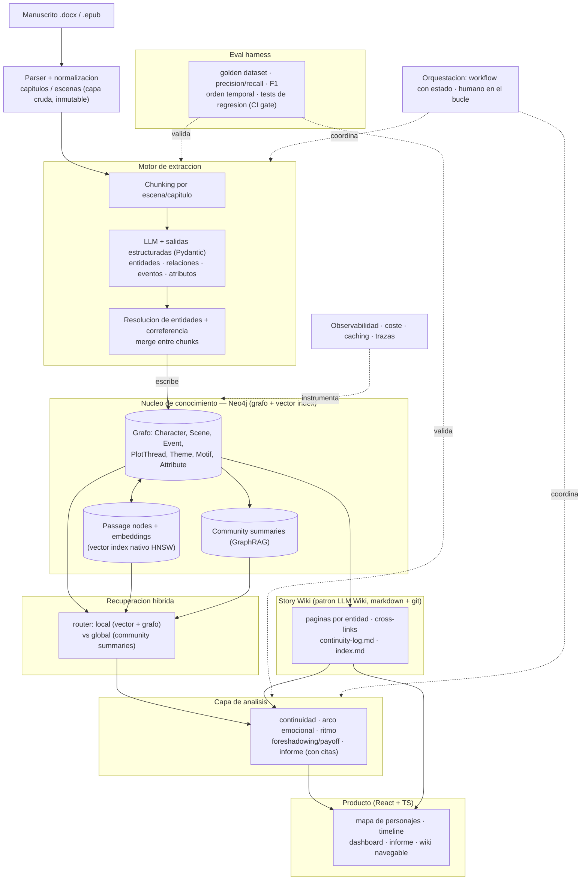

# 📖 Loom — Motor editorial de IA para ficción narrativa

> **Estado:** especificación inicial (v0.1) · **Audiencia objetivo:** autor indie / novel · **Alcance v1:** solo lo que la IA resuelve de verdad (no imprenta ni distribución física).

`Loom` (nombre provisional) toma una novela completa y construye una **representación estructurada y navegable** de ella: un grafo de conocimiento + una "Story Wiki" viva. Sobre esa base ofrece a su autor un espejo de su propio libro: mapa de personajes que evoluciona, línea temporal, arco emocional, ritmo, alertas de continuidad y un informe de lectura anclado en citas.

Este documento es a la vez el README del proyecto y el **contrato de trabajo para los agentes de código** que lo implementarán. Está escrito para que un agente pueda leerlo y saber qué construir, en qué orden, y cómo saber que lo ha hecho bien (criterios de aceptación por milestone).

---

## 1. Qué es y qué no es

**Es:** la capa de inteligencia editorial. Toma un manuscrito y produce análisis, diagnóstico y entregables que normalmente hace un editor de mesa y un lector profesional.

**No es (en v1):** una imprenta ni una distribuidora. Las etapas físicas (impresión, distribución) se *integran* más adelante con print-on-demand (KDP, IngramSpark) vía sus flujos; no se construyen.

**Principio rector — profundidad antes que amplitud.** Esto es un proyecto de portfolio de ingeniería de IA y un posible negocio. El valor está en hacer *una cosa difícil con rigor*, no nueve cosas a medias. La cosa difícil es la extracción precisa de un grafo narrativo a partir de una novela larga, y su **evaluación medible**.

---

## 2. Las tres ideas que sostienen el proyecto

1. **El grafo es la columna vertebral.** No es una feature de analítica: es el sustrato del que leen y al que escriben todas las etapas. Continuidad, arcos, informe, wiki, todo se deriva del mismo grafo. Eso convierte el producto en una plataforma coherente y no en herramientas sueltas.

2. **Compilar el conocimiento, no re-descubrirlo (patrón LLM Wiki).** El RAG clásico re-descubre el libro en cada pregunta. Aquí seguimos el patrón *LLM Wiki* (Karpathy, 2026): el LLM **compila una vez** el conocimiento en una wiki de markdown interconectada (una página por personaje, lugar, trama, tema) y la **mantiene actualizada** cuando el manuscrito cambia. La pregunta luego lee resúmenes ya elaborados, no fragmentos crudos. El grafo da la estructura consultable; la wiki da la capa legible para humanos. Se complementan.

3. **Eval-first.** Cualquiera enchufa un LLM y saca un mapa que *parece* correcto. Lo que diferencia este proyecto (y a un ingeniero senior) es **medir** si la extracción es correcta: dataset de oro, precisión/recall, tests de regresión que bloquean el merge. Ningún módulo se da por terminado sin su eval verde.

---

## 3. Arquitectura



La diferencia clave con la versión anterior: **Neo4j hace de grafo Y de base de datos vectorial** (tiene índice vectorial nativo HNSW). Eliminamos Qdrant/pgvector del stack. Un `Passage` es un nodo del grafo con su `embedding` como propiedad, indexado vectorialmente, y conectado por relaciones a la escena de la que procede. Así la recuperación combina similitud semántica y recorrido del grafo en una sola consulta Cypher.

---

## 4. Stack tecnológico

| Capa | Elección | Notas |
|------|----------|-------|
| Lenguaje backend | Python 3.12+ | |
| API | FastAPI + Pydantic v2 | Pydantic es **el contrato** de toda extracción LLM |
| Orquestación | Prefect (o Temporal) | Pipeline largo, reanudable, con puertas humanas. No usar una cadena de funciones suelta |
| LLM | Interfaz propia agnóstica de proveedor | Salidas estructuradas vía tool-use / JSON schema (p. ej. con `instructor`). Modelos clase Claude/GPT |
| Embeddings | Modelo de embeddings del proveedor | Guardados como propiedad de `Passage` |
| Grafo + vectores | **Neo4j 5.x** | Índice vectorial nativo + APOC + GDS (Leiden para community detection) |
| Correferencia | LLM-assisted + verificación; alternativa `fastcoref`/`spaCy` | Ver §6, es el punto crítico |
| Parsing | `python-docx`, `ebooklib` (EPUB), `unstructured` | La ingesta es más sucia de lo que parece |
| Wiki | Markdown en git | Capa "compilada", versionable, renderizable en la app |
| Frontend | React + TypeScript + Vite | |
| Visualización | `react-force-graph` o Cytoscape.js (grafo), `visx`/`d3` (arcos/ritmo), `vis-timeline` (cronología) | |
| Observabilidad | OpenTelemetry + tracing LLM (p. ej. Langfuse) + conteo de tokens | |
| Tests | `pytest` (lógica) + eval harness aparte (calidad de IA) | |
| Infra dev | `docker-compose` (Neo4j + API) | |

---

## 5. Modelo de datos (esquema del grafo)

Pensado para **ficción narrativa**. Toda propiedad relevante guarda `asserted_in_scene` para poder rastrear el origen (citas) y detectar contradicciones.

### Nodos

- **`Character`** — `name`, `aliases[]`, `role` (protagonist/antagonist/secondary), `description`, `first_scene`, `voice_profile` (estilometría de sus diálogos).
- **`Location`** — `name`, `aliases[]`, `description`.
- **`Chapter`** — `number`, `title`, `word_count`, `pov_character`, `summary`.
- **`Scene`** — `index_narrative` (orden de lectura), `summary`, `tension_score` (0–1), `sentiment` (para el arco emocional), `time_marker` (marca temporal en la ficción).
- **`Event`** — `description`, `order_narrative`, `order_chronological` (¡pueden diferir! → base del análisis de timeline y flashbacks).
- **`PlotThread`** — `name`, `description`, `status` (setup/developing/resolved).
- **`Theme`**, **`Motif`** (objeto/símbolo, p. ej. "pistola de Chéjov").
- **`Attribute`** — `key` (p. ej. `eye_color`), `value`, `asserted_in_scene`. **Es la pieza que habilita la detección de continuidad** (dos `Attribute` con misma `key` y distinto `value` para el mismo personaje = posible error).
- **`Passage`** — `text`, `embedding` (vector index), enlazado a su `Scene`. Es la unidad de recuperación y la **fuente de toda cita**.
- **`CommunitySummary`** — resumen jerárquico generado por GraphRAG (ver §7).

### Relaciones (ejemplos)

```
(Character)-[:APPEARS_IN]->(Scene)
(Character)-[:RELATES_TO {kind, sentiment, since_chapter}]->(Character)   // evoluciona en el tiempo
(Character)-[:HAS_ATTRIBUTE]->(Attribute)
(Scene)-[:SET_IN]->(Location)
(Chapter)-[:HAS_SCENE]->(Scene)
(Scene)-[:NEXT]->(Scene)                 // orden narrativo
(Event)-[:BEFORE]->(Event)               // orden cronológico
(Event)-[:INVOLVES]->(Character)
(Event)-[:PART_OF]->(PlotThread)
(Motif)-[:PLANTED_IN]->(Scene)
(Motif)-[:PAID_OFF_IN]->(Scene)          // foreshadowing/payoff tracker
(Passage)-[:FROM]->(Scene)
```

**Relaciones que cambian en el tiempo:** modelar `RELATES_TO` con propiedades versionadas por capítulo, o introducir nodos `RelationshipState {chapter, kind, sentiment}` cuando se necesite reconstruir "el estado del mapa de personajes en el capítulo N". Empezar simple (propiedad `since_chapter`) y promover a nodos-estado solo si la feature de "mapa que evoluciona" lo exige.

---

## 6. Pipeline de extracción (el módulo más difícil)

Orden de procesamiento por escena/capítulo, con **map-reduce** para no reventar el contexto ni el coste:

1. **Chunking** por escena (preferible) o capítulo. Mantener metadatos de posición.
2. **Extracción estructurada**: el LLM devuelve objetos Pydantic (nunca texto libre que luego parseamos). Una llamada por chunk extrae personajes mencionados, relaciones, eventos, atributos, motivos.
3. **Resolución de entidades + correferencia** — *el problema central*. "Elena", "ella", "la doctora", "Eli" deben colapsar en una entidad a lo largo de 100k palabras. Estrategia recomendada:
   - Mantener un **registro de entidades** acumulado que se pasa como contexto a cada chunk ("estos personajes ya existen: …") para que el LLM enlace en vez de duplicar.
   - Fusión por similitud (embedding del nombre + heurísticas) con **umbral de confianza**; por debajo del umbral, marcar para **revisión humana** (no fusionar a ciegas).
   - La calidad de esta fusión se mide explícitamente en la eval (ver §9).
4. **Escritura idempotente al grafo**: cada chunk se cachea por *hash de contenido*, de modo que re-ejecutar el pipeline tras un cambio menor sea barato.

> ⚠️ **Si esto falla, todo lo demás es ruido.** Aquí va el grueso del esfuerzo de I+D y aquí empieza la eval (M1).

---

## 7. Recuperación híbrida + GraphRAG

Dos tipos de pregunta necesitan dos caminos:

- **Local** ("¿cuándo se conocieron Elena y Marco?"): búsqueda vectorial sobre `Passage` (índice nativo de Neo4j) + expansión por el grafo (1–2 saltos) → respuesta anclada en citas de pasajes.
- **Global** ("¿cuál es el arco general?", "¿qué temas dominan?"): el RAG normal falla porque la respuesta no está en ningún chunk concreto. Aplicamos **GraphRAG**: detección de comunidades con Leiden (Neo4j GDS) sobre el subgrafo de personajes/eventos, y **resúmenes jerárquicos** (`CommunitySummary`) que el LLM precompila. Las preguntas globales se responden agregando esos resúmenes.

Un **router** clasifica la consulta (local vs global) y elige el camino. Toda respuesta analítica **debe** enlazar al menos a un `Passage` (id) — sin cita, no se muestra. Esto es lo que mata la alucinación.

---

## 8. Story Wiki (patrón LLM Wiki aplicado a la novela)

Tres capas, al estilo Karpathy:

1. **Fuentes (inmutable):** el manuscrito normalizado.
2. **Wiki (generada por el LLM):** directorio de markdown interconectado — `characters/elena.md`, `locations/la-casa.md`, `threads/la-herencia.md`, `themes/perdon.md`, más `index.md` y `continuity-log.md`. Cada página: resumen, hechos, wikilinks a entidades relacionadas, y **enlaces a las escenas/pasajes que la sustentan**.
3. **Esquema (reglas):** qué tipos de página existen, qué frontmatter llevan, cómo se enlazan.

La wiki se **deriva del grafo** y se **mantiene con awareness del diff**: cuando el autor edita capítulos, solo se regeneran las páginas afectadas. Es la "biblia de la historia" que un autor de serie pagaría por sí sola, y como es git, el autor obtiene historial y diffs gratis. (Bonus meta: el propio repositorio del proyecto puede mantener su documentación con este mismo patrón.)

---

## 9. Eval harness (la pieza que te hace senior)

**Golden dataset:** anotación humana del libro de tu amigo (y, después, 1–2 novelas de dominio público de Project Gutenberg para robustez): lista real de personajes, alias, relaciones, cronología de eventos, atributos clave.

**Métricas:**

- Extracción de entidades: **precision / recall / F1**.
- Resolución de entidades (clustering): **B-cubed** o F1 por pares.
- Extracción de relaciones: **F1**.
- Orden cronológico de eventos: **tau de Kendall** vs el orden anotado.
- Detección de continuidad: **precisión de las alertas** (¿lo marcado es un error real?) — métrica crítica, los falsos positivos destruyen la confianza.
- Calidad del informe de lectura: **LLM-as-judge** con rúbrica fija (usar con cautela, complementar con revisión humana puntual).

**Regresión:** se ejecuta en cada cambio de prompt o modelo; los resultados se versionan en una tabla y actúan de **gate en CI**: si una métrica clave baja, no se mergea. Un pequeño `eval/` con runner, datasets y reporte comparativo.

---

## 10. Orquestación, operación y coste

- **Workflow con estado** (Prefect/Temporal): cada manuscrito es un proceso largo, reanudable, con pasos idempotentes y **puertas de aprobación humana** (p. ej. confirmar fusiones de entidades dudosas).
- **Caching agresivo**: extracción cacheada por hash de contenido + prompt caching del proveedor. Re-procesar un libro tras editar un capítulo solo recomputa lo cambiado.
- **Observabilidad**: trazas de cada llamada LLM, conteo de tokens y coste por etapa, para poder optimizar y para demostrar madurez de ingeniería.

---

## 11. Estructura del repositorio

```
loom/
├── README.md                 # este documento
├── docker-compose.yml        # Neo4j + API
├── backend/
│   ├── ingest/               # parsers docx/epub → capa cruda
│   ├── extraction/           # LLM + Pydantic schemas + entity resolution
│   ├── graph/                # cliente Neo4j, Cypher, esquema, migraciones
│   ├── retrieval/            # router local/global, vector + GraphRAG
│   ├── wiki/                 # generador/mantenedor de la Story Wiki
│   ├── analysis/             # continuidad, arcos, ritmo, foreshadowing, informe
│   ├── llm/                  # interfaz agnóstica de proveedor
│   ├── orchestration/        # flujos Prefect/Temporal
│   └── api/                  # FastAPI
├── eval/                     # golden datasets, runner, métricas, reportes
├── frontend/                 # React + TS (mapa, timeline, dashboard, wiki)
├── wiki/                     # Story Wiki generada (markdown, versionada)
└── docs/                     # ADRs, decisiones de diseño
```

---

## 12. Roadmap por milestones (depth-first, eval-gated)

Cada milestone tiene un **criterio de aceptación**. No se avanza al siguiente sin cumplirlo.

- **M0 · Scaffolding.** Repo, docker-compose con Neo4j, FastAPI skeleton, ingesta `.docx`→capítulos/escenas normalizados (capa cruda). *DoD: subir el libro de tu amigo y verlo segmentado correctamente en escenas.*
- **M1 · Personajes + eval (núcleo del portfolio).** Extracción y resolución de **solo personajes** → grafo. Eval harness con golden dataset. *DoD: F1 de detección ≥ umbral objetivo y precisión de resolución medida sobre el libro real.*
- **M2 · Relaciones entre personajes + eval.** Extracción de relaciones por par (tipo, descriptor, procedencia) → grafo. *DoD: F1 de detección de pares y accuracy de tipo ≥ umbral sobre obras crafted.* (El bloque "M2 = relaciones + atributos + continuidad" del plan original se descompuso: relaciones aquí, atributos en M3, detección de continuidad como consumidor posterior del grafo.)
- **M3 · Atributos de personaje + eval.** Extracción de atributos invariantes físicos/identidad + estado vital (`Attribute`/`AttributeEvidence`), con procedencia escena+cita y **sin colapsar valores contradictorios** (la señal que habilita la continuidad). *DoD: F1 de extracción de tripletas `(personaje, key, valor)` ≥ umbral; la contradicción "ojos azules cap.2 / verdes cap.18" queda representada como dos valores del mismo atributo.* La **detección de continuidad** (alertas, precisión de alertas) es una spec de análisis posterior que consume esta capa.
- **M4 · Escenas, eventos y timeline.** Orden narrativo vs cronológico. *DoD: vista de cronología + tau de Kendall vs anotación.*
- **M5 · Recuperación híbrida + GraphRAG.** Router local/global, community summaries, Q&A **con citas obligatorias**. *DoD: respuestas locales y globales correctas, todas ancladas a pasajes.*
- **M6 · Story Wiki.** Generación y mantenimiento diff-aware de la wiki markdown (híbrida grafo + prosa — ver `docs/graph-north.md`). *DoD: editar un capítulo regenera solo las páginas afectadas.*
- **M7 · Análisis.** Arco emocional, heatmap de ritmo, foreshadowing/payoff, informe de lectura. *DoD: informe generado, sin afirmaciones sin cita.*
- **M8 · Frontend.** Mapa de personajes, timeline, dashboard, informe, wiki navegable. *DoD: recorrido completo desde subir libro hasta explorar resultados.*
- **M9 · Endurecimiento.** Orquestación, observabilidad, coste, caching. *DoD: re-proceso incremental barato + trazas y coste por etapa visibles.*

---

## 13. Convenciones para los agentes de código

- **Pydantic es el contrato.** Ninguna salida de LLM se parsea como texto libre; siempre esquema tipado validado.
- **Una sola puerta al LLM.** Todas las llamadas pasan por `backend/llm/`; nada de SDKs dispersos por el código.
- **Citas obligatorias.** Toda afirmación analítica referencia un `Passage` por id. Sin cita, no se emite.
- **Idempotencia y cache.** La extracción se cachea por hash de contenido; re-ejecutar debe ser barato y determinista en lo posible.
- **Eval antes de merge.** Un milestone no está "hecho" sin su eval verde; la regresión es gate de CI.
- **Cypher revisable.** Las consultas al grafo viven en `backend/graph/` con nombre, no incrustadas ad hoc.
- **Docs vivas.** La carpeta `docs/` y la Story Wiki se mantienen con el patrón LLM Wiki: cada cambio relevante actualiza la página correspondiente.

---

## 14. Riesgos y mitigaciones

| Riesgo | Mitigación |
|--------|-----------|
| Extracción imprecisa (riesgo nº1) | Eval-first desde M1; nada se construye encima de métricas rojas |
| Alucinación en análisis/informe | Anclaje obligatorio a `Passage` + citas |
| Coreference/resolución difícil | LLM-assisted + umbral de confianza + revisión humana de fusiones dudosas |
| Coste en tokens (libros largos) | Map-reduce + cache por hash + prompt caching |
| Eval con un solo libro | Añadir novelas de dominio público (Gutenberg) |
| Confianza/privacidad del autor | "No entrenamos con tu obra"; manejo de datos explícito; opción de borrado |
| Feature creep | Roadmap depth-first; resistir portada/traducción/imprenta hasta tener el núcleo sólido |

---

## 15. Glosario

- **Grafo de conocimiento narrativo:** representación en Neo4j de personajes, relaciones, eventos, tramas y temas de la novela.
- **Patrón LLM Wiki:** compilar y mantener una wiki markdown interconectada en vez de re-recuperar fragmentos en cada consulta.
- **GraphRAG:** RAG sobre grafo con detección de comunidades y resúmenes jerárquicos para responder preguntas globales.
- **Resolución de entidades:** colapsar todas las menciones (nombres, alias, pronombres) de una misma entidad en un nodo único.
- **Eval harness:** conjunto de datasets de oro + métricas + tests que miden la calidad del sistema de IA, no solo del modelo.
- **DoD (Definition of Done):** criterio objetivo que cierra un milestone.
